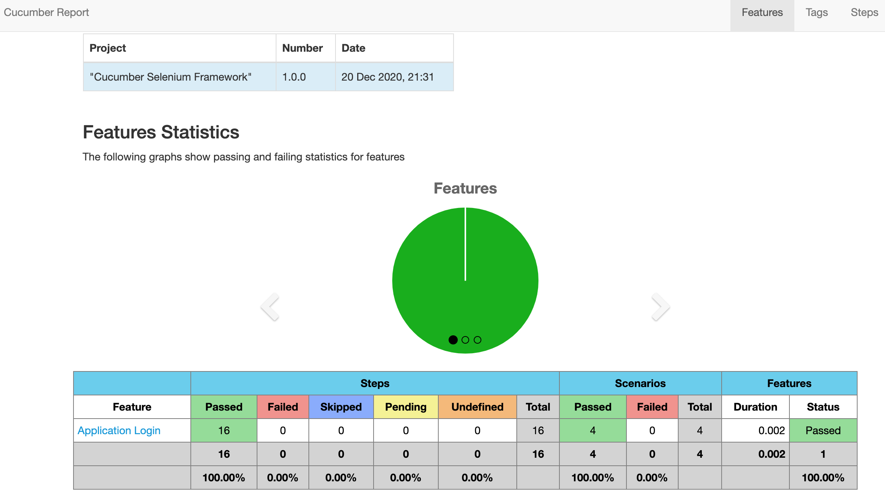

## Selenium-Cucumber-Framework
Automation framework using Cucumber, Java and Selenium with Maven

### Prerequisites:
- Java 8
- Maven

### Run Tests with default TestRunner options
> mvn test

### Run Tests for a particular tag
> mvn test -Dcucumber.options="-t @smoketest"

### Reports
> reports/cucumber-html-reports

